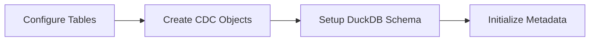
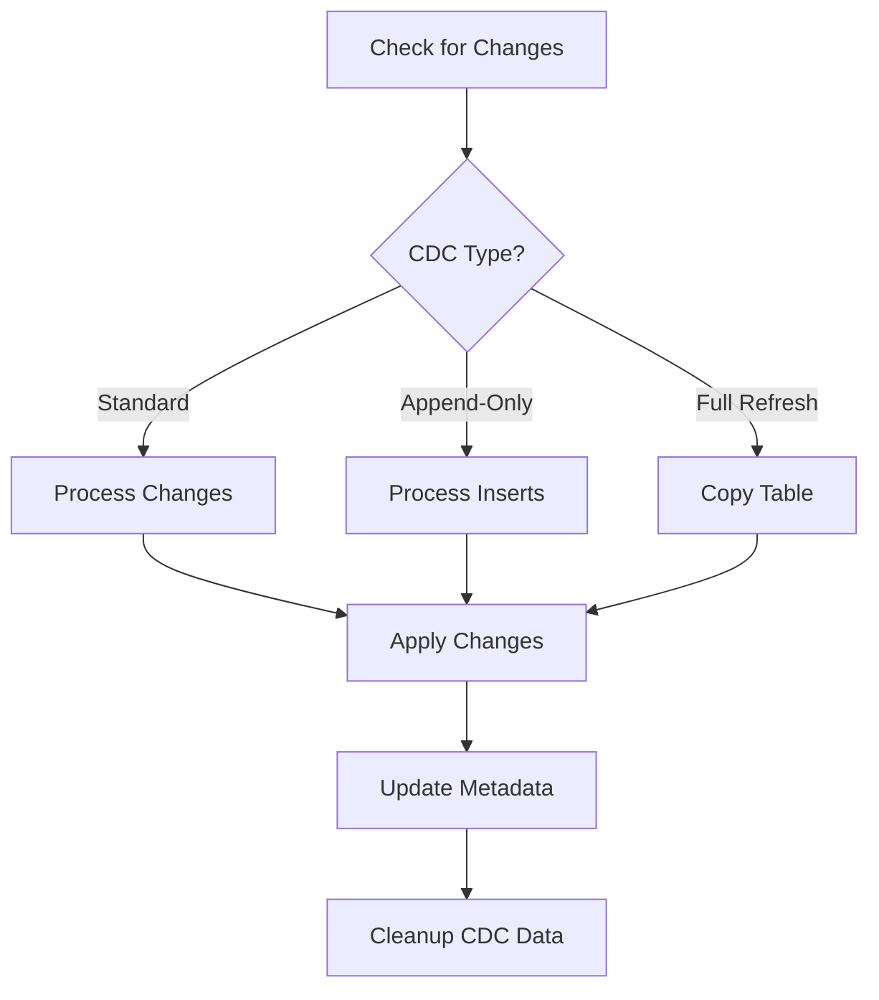

<!-- readme.md -->
# Melchi

## Overview  📚

Melchi is a Snowflake to DuckDB replication tool that handles both initial data ingestion and continuous updates through CDC (Change Data Capture). It gives you a local, synchronized copy of your Snowflake data without the overhead of managing complex ETL processes.

Here's how Melchi works:

1. You provide a list of Snowflake tables you want to replicate.
2. Run the setup command in the terminal.
3. Melchi automatically:
   - Creates equivalent tables in DuckDB based on your Snowflake table schemas
   - Sets up streams and change tracking tables in Snowflake for each replicated table
   - Creates change tracking tables in DuckDB to monitor update times

Once set up, simply run the `sync_data` command whenever you need to update. Melchi efficiently checks Snowflake for inserts, updates, and deletes, and applies these changes to DuckDB.

All you need to do is set up a role in Snowflake with the appropriate permissions. Melchi handles the rest, providing a low-maintenance, efficient solution for keeping your DuckDB instance in sync with Snowflake.

## Why Melchi? 🤔

Melchi fills specific gaps in the data replication landscape:

### Key Use Cases

1. **DuckDB Evaluation**
   - Test DuckDB performance against your Snowflake workloads
   - Experiment with DuckDB without disrupting production
   - Compare query costs and performance
   - Prototype analytics workflows locally

2. **Data Warehouse to Data Warehouse**
   - Most CDC tools focus on OLTP → warehouse pipelines (databases → Snowflake)
   - Melchi specializes in warehouse → warehouse movement
   - Handles warehouse-specific data types properly (ARRAY, VARIANT, GEOGRAPHY)
   - Optimized for analytical workload patterns

3. **Local Development Environment**
   - Work with production data locally without Snowflake costs
   - Fast iteration on analytics queries
   - Develop and test without internet connectivity
   - Quick setup for new team members

4. **Cost Optimization**
   - Reduce Snowflake compute costs for development and testing
   - Cache frequently accessed data locally
   - Run expensive queries without warehouse costs
   - Prototype optimizations before production deployment

Would you consider using Melchi? Let us know your use case in the [Discord community](https://discord.gg/MEpEACAz).

## Quick Start 🚀

Get a local copy of your Snowflake data in 5 minutes:

1. Clone and set up:
```bash
git clone https://github.com/ryanwith/melchi.git
cd melchi
python3 -m venv venv && source venv/bin/activate  # On Windows: venv\Scripts\activate
pip install -r requirements.txt
```

2. Create `config/config.yaml`:
```yaml
source:
  type: snowflake
  account: ${SNOWFLAKE_ACCOUNT_IDENTIFIER}
  user: ${SNOWFLAKE_USER}
  password: ${SNOWFLAKE_PASSWORD}
  role: YOUR_ROLE
  warehouse: YOUR_WAREHOUSE
  change_tracking_database: melchi_cdc_db
  change_tracking_schema: streams

target:
  type: duckdb
  database: output/local.duckdb
  change_tracking_schema: melchi

tables_config:
  path: "config/tables_to_transfer.csv"
```

3. Create `config/tables_to_transfer.csv`:
```csv
database,schema,table,cdc_type
your_db,your_schema,your_table,full_refresh
```

4. Set environment variables in `.env`:
```bash
SNOWFLAKE_ACCOUNT_IDENTIFIER=your_account
SNOWFLAKE_USER=your_username
SNOWFLAKE_PASSWORD=your_password
```

5. Run initial setup and sync:
```bash
python main.py setup --config config/config.yaml
python main.py sync_data --config config/config.yaml
```

Your data is now in DuckDB! Query it with:
```python
import duckdb
conn = duckdb.connect('output/local.duckdb')
conn.execute('SELECT * FROM your_schema.your_table').fetchall()
```

See [Configuration](#configuration) for detailed setup options and [CDC Types](#cdc-types) for advanced change tracking strategies.

## Technical Architecture 🔧

### Overview

Melchi uses a combination of Snowflake's native change tracking features and custom metadata tables to efficiently synchronize data. Here's how the key components work together:

### Core Components

#### 1. CDC Tracking Layer
- **Standard Streams**: Uses Snowflake's native stream objects to capture INSERTs, UPDATEs, and DELETEs
- **Append-Only Streams**: Uses Snowflake's native append-only stream objects to capture INSERTs
- **Full Refresh**: Direct table copies.  Good for smaller tables or for initial tests
- **Processing Tables**: Temporary staging areas in Snowflake for batching changes

#### 2. Metadata Management
- **Source Tracking**: Maintains table schemas, primary keys, and CDC configurations
- **Sync State**: Tracks last successful sync time and change volumes
- **Row Identification**: Adds `melchi_row_id` for tables using streams without primary keys

#### 3. Data Movement Pipeline
```
[Snowflake Source] → [Change Detection] → [Batched Processing] → [DuckDB Target]
```

### Key Design Decisions

1. **Transactional Consistency**
   - All operations are wrapped in transactions
   - Failed syncs roll back completely
   - No partial updates are committed
   - Source cleanup only occurs after successful target commit

2. **Memory Management**
   - Streams process data in configurable batch sizes
   - Large tables are chunked automatically
   - Pandas DataFrames used for efficient type conversion
   - Memory usage scales with batch size, not table size

3. **Type System**
   - Automated type mapping between Snowflake and DuckDB
   - Handles complex types (ARRAY, VARIANT, GEOGRAPHY)
   - Preserves precision for numeric types
   - Consistent timezone handling for timestamps

4. **Error Handling**
   - Automatic retry logic for transient failures
   - Preserves CDC data on failed syncs
   - Detailed error logging and state tracking
   - Self-healing for interrupted syncs

### Sync Process Flow

1. **Initial Setup**


2. **Regular Sync**


### Limitations

1. **Current Limitations**
- Geography and Geometry columns not supported with `standard_stream` due to snowflake limitations
- Special characters are not supported in schema, table, or column names
- Primary keys must be defined in Snowflake for streams (or a `melchi_row_id` will be added)
- All tables must be replaced together when modifying the transfer configuration
- You cannot replicate tables with the same schema and column names into duckdb, even if they are in different databases in Snowflake

### Future Architecture Plans

1. **Planned Enhancements**
   - Additional warehouse support (BigQuery, Redshift)
   - Additional CDC mechanisms

2. **Under Consideration**
   - Real-time CDC using Snowflake tasks
   - Built-in data validation
   - Web UI for monitoring
   - Multi-target sync support

## CDC Types

Melchi supports three different Change Data Capture (CDC) strategies that can be specified for each table in your `tables_to_transfer.csv` file. All strategies provide transactional consistency - the key differences are in how changes are detected and synchronized.

### Full Refresh (`full_refresh`)
- **How it works**: Completely drops and recreates the target table during each sync
- **Best for**:
 - Small lookup tables (< 100k rows)
 - Tables where change tracking setup in Snowflake is not desired
 - Testing and initial setup
- **Advantages**:
 - Simplest to set up - no change tracking required
 - Works with all column types including GEOGRAPHY and GEOMETRY
- **Disadvantages**:
 - Resource intensive for large tables
 - Higher latency as entire table must be transferred
 - Higher costs due to full data scanning
- **Example use case**: A small configuration table that changes completely several times a day

### Standard Stream (`standard_stream`)
- **How it works**: Uses Snowflake's standard streams to capture all changes (inserts, updates, and deletes)
- **Best for**:
 - Large tables with frequent changes
 - Tables needing update and delete tracking
- **Advantages**:
 - Efficient for large tables with moderate change volumes
 - Captures all types of changes (inserts, updates, deletes)
- **Disadvantages**:
 - Cannot be used with GEOGRAPHY or GEOMETRY columns (Snowflake limitation)
 - Requires a Snowflake role with permissions to create tables and streams in the CDC schema
- **Example use case**: A customer table where records are frequently updated and occasionally deleted

### Append-Only Stream (`append_only_stream`)
- **How it works**: Uses Snowflake's append-only streams to capture only new records
- **Best for**:
 - Tables that have only inserts such as log tables, event data, and time-series data
 - Tables with GEOGRAPHY or GEOMETRY columns that need streaming
- **Advantages**:
 - Most efficient for append-only patterns
 - Works with all column types including GEOGRAPHY and GEOMETRY
- **Disadvantages**:
 - Cannot capture updates or deletes
 - Requires a Snowflake role with permissions to create tables and streams in the CDC schema
- **Example use case**: An event logging table where records are only ever inserted

### Choosing the Right CDC Type

1. Start with these questions:
  - Does your table contain GEOGRAPHY or GEOMETRY columns?
    - If yes: Use `append_only_stream` or `full_refresh`
  - Is your table append-only?
    - If yes: Use `append_only_stream`
  - Do you need to track updates and deletes?
    - If yes: Use `standard_stream`
  - Is your table small (< 100k rows)?
    - If yes: Consider `full_refresh`

2. Consider your data patterns:
  - High update frequency → `standard_stream`
  - Insert-only patterns → `append_only_stream`
  - Small reference tables → `full_refresh`

3. Consider your resources:
  - Limited Snowflake compute → Avoid `full_refresh` for large tables
  - Need minimal latency → Use streams (`standard_stream` or `append_only_stream`)
  - Limited setup time → Start with `full_refresh`

## Installation  📥

### Prerequisites

- Python 3.7 or later
- Git

### Steps

1. Clone the repository:
   ```bash
   git clone https://github.com/ryanwith/melchi.git
   cd melchi
   ```

2. Set up a virtual environment:
   ```bash
   python3 -m venv venv
   ```

3. Activate the virtual environment:
   - On macOS and Linux:
     ```bash
     source venv/bin/activate
     ```
   - On Windows:
     ```bash
     venv\Scripts\activate
     ```

4. Install dependencies:
   ```bash
   pip install -r requirements.txt
   ```

5. Set up environment variables:
   Create a `.env` file in the project root directory and add your Snowflake and DuckDB credentials:
   ```
   SNOWFLAKE_ACCOUNT=your_account
   SNOWFLAKE_USER=your_username
   SNOWFLAKE_PASSWORD=your_password
   ```

6. Verify the installation:
   ```bash
   python main.py --help
   ```
   If you see the help message with available commands, Melchi is installed correctly.

### Troubleshooting

If you encounter any issues during installation, please check the following:
- Ensure you're using Python 3.7 or later
- Make sure all environment variables are set correctly
- Check that you have the necessary permissions to install packages and create directories

## Configuration

Melchi uses a YAML configuration file to manage connections and specify which tables to replicate. Follow these steps to set up your configuration:

1. Create a `config.yaml` file in the config folder in the root directory.

2. Add the following sections to your `config.yaml`:

```yaml
source:
  type: snowflake
  account: ${SNOWFLAKE_ACCOUNT_IDENTIFIER}
  user: ${SNOWFLAKE_USER}
  # For username/password authentication:
  # Leave authenticator field out completely (do not set it to blank)
  password: ${SNOWFLAKE_PASSWORD}
  # For SSO via browser authentication:
  # authenticator: externalbrowser  # Uncomment this line for SSO
  role: snowflake_role_to_use
  warehouse: snowflake_warehouse_to_use
  change_tracking_database: database_with_change_tracking_schema
  change_tracking_schema: name_of_change_tracking_schema
  # Optional: Use a connection profile file for any of the above settings
  # connection:
  #   file_path: "path/to/your/config.toml"
  #   profile_name: "dev"  # Optional - uses default profile if not specified

target:
  type: duckdb
  database: /path/to/your/local/duckdb/database.duckdb
  change_tracking_schema: name_of_change_tracking_schema

tables_config:
  path: "path/to/your/tables_to_transfer.csv"
```

Replace placeholders with your actual Snowflake and DuckDB details. The DuckDB database will be created by default at runtime as long as the directory you're referring to exists.

### Authentication

Melchi supports two authentication methods:

1. **Username/Password** (default): 
   - Requires `password` to be set
   - Do not include the `authenticator` field at all

2. **SSO via Browser**:
   - Set `authenticator: externalbrowser`
   - `password` field will be ignored if present

### Connection Profiles

Optionally, you can store some or all of your Snowflake connection details in a TOML file:

```yaml
source:
  connection:
    file_path: "path/to/your/config.toml"
    profile_name: "dev"  # Optional - uses default profile if not specified
```

Any values specified in the connection profile file will override corresponding values in the YAML config. You can specify just a few parameters in the profile file or all of them - it's up to you.


## Usage

### Command Line Arguments

- `action`: Required. One of:
  - `setup`: Sets up CDC tracking and creates target tables
  - `sync_data`: Syncs data from source to target
  - `generate_source_sql`: Generates SQL needed for source setup
- `--config`: Optional. Path to configuration file (default: 'config/config.yaml')
- `--output`: Optional. Output directory for generated SQL (default: 'output')
- `--replace_existing`: Optional. When used with `setup`, drops and recreates existing CDC tracking objects and target tables. Use with caution in production.

#### Examples:

```bash
# Initial setup
python main.py setup --config config/config.yaml

# Add new tables to track.  This sets up CDC for any new tables you add to the table transfer file while not touching existing tables.
python main.py setup --config config/config.yaml

# Setup with replacement of existing objects.  This completely recreates all CDC tracking objects and tables in the source and target.
python main.py setup --config config/config.yaml --replace_existing

# Regular data sync
python main.py sync_data --config config/config.yaml

# Generate source SQL
python main.py generate_source_sql --config config/config.yaml
```

The `--replace_existing` flag is particularly useful when:
- Changing CDC types for existing tables
- Resetting CDC tracking after schema changes
- Testing different configurations
- Recovering from certain error states

**Warning**: Using `--replace_existing` will drop and recreate all existing CDC tracking objects and tables in the source and target.  It will also recreate all tables in the target.  Use with caution in production.

## Configuration

Melchi uses a YAML configuration file to manage connections and specify which tables to replicate. Follow these steps to set up your configuration:

1. Create a `config.yaml` file in the config folder in the root directory.

2. Add the following sections to your `config.yaml`:

   ```yaml
   source:
     type: snowflake
     account: ${SNOWFLAKE_ACCOUNT_IDENTIFIER}
     user: ${SNOWFLAKE_USER}
     password: ${SNOWFLAKE_PASSWORD}
     role: snowflake_role_to_use
     warehouse: snowflake_warehouse_to_use
     change_tracking_database: database_with_change_tracking_schema
     change_tracking_schema: name_of_change_tracking_schema

   target:
     type: duckdb
     database: /path/to/your/local/duckdb/database.duckdb
     change_tracking_schema: name_of_change_tracking_schema

   tables_config:
     path: "path/to/your/tables_to_transfer.csv"
   ```

   Replace placeholders with your actual Snowflake and DuckDB details.  Additionally, the duckdb database will be created by default at runtime as long as the director you're referring to exists.

3. Create a `tables_to_transfer.csv` (or other name you specify in the config) file in the `config` directory to specify which tables to replicate:

   ```csv
   database,schema,table,cdc_type
   your_db,your_schema,table1,full_refresh
   your_db,your_schema,table2,standard_stream
   your_db,your_schema,table3,append_only_stream
   ```

   The `cdc_type` column specifies how changes should be tracked for each table:
   - `full_refresh`: Completely refreshes the table in DuckDB with each sync by dropping and recreating it.  This is the default if no cdc_type is specified.
   - `standard_stream`: Uses Snowflake's standard streams to capture inserts, updates, and deletes.
   - `append_only_stream`: Uses Snowflake's append-only streams for insert-only tables (more efficient for append-only data).

4. Set up environment variables in a `.env` file:

   ```
   SNOWFLAKE_ACCOUNT_IDENTIFIER=your_account
   SNOWFLAKE_USER=your_username
   SNOWFLAKE_PASSWORD=your_password
   DUCKDB_DATABASE_PATH=/path/to/your/duckdb/database.db
   ```

Ensure all configuration files are properly set up before running Melchi.  Note.  If you do not have a duckdb database file, Melchi will create one at the path you specify.

## Permissions

To use Melchi effectively, you need to set up the correct permissions in Snowflake. Here's how to do it:

1. Create a dedicated role in Snowflake for Melchi:

   ```sql
   USE ROLE ACCOUNTADMIN;
   CREATE ROLE melchi_role;
   ```

2. Grant the necessary permissions to this role. You can do this manually or use Melchi's `generate_source_sql` feature to help you.

### Manual Permission Setup

If you prefer to set up permissions manually, you need to grant the following:

- Usage on the warehouse
- Usage on the databases and schemas containing the tables you want to replicate
- Select permission on the tables you want to replicate
- Create Table and Create Stream permissions on the change tracking schema

For example:

```sql
GRANT USAGE ON WAREHOUSE your_warehouse TO ROLE melchi_role;
GRANT USAGE ON DATABASE your_db TO ROLE melchi_role;
GRANT USAGE ON SCHEMA your_db.your_schema TO ROLE melchi_role;
GRANT SELECT ON TABLE your_db.your_schema.your_table TO ROLE melchi_role;
GRANT CREATE TABLE, CREATE STREAM ON SCHEMA change_tracking_db.change_tracking_schema TO ROLE melchi_role;
```

### Using generate_permissions

Melchi provides a `generate_permissions` feature to help you create the necessary SQL statements for setting up permissions. To use it:

1. Ensure your `config.yaml` and `tables_to_transfer.csv` are correctly set up.

2. Run the following command:

   ```bash
   python main.py generate_permissions
   ```

3. This will generate a file named `source_setup.sql` in the `output` directory. Review this file to ensure it meets your security requirements.

4. Execute the SQL statements in the generated file in your Snowflake account to set up the permissions.

Remember to enable change tracking on the tables you want to replicate:

```sql
ALTER TABLE your_db.your_schema.your_table SET CHANGE_TRACKING = TRUE;
```

By following these steps, you'll have the necessary permissions set up in Snowflake for Melchi to operate effectively.

## Usage

Melchi provides several commands to manage your data synchronization process. Here's how to use each of them:

### 1. Generate Source SQL

Before you start using Melchi, you need to set up the necessary permissions and change tracking in Snowflake. Use the following command to generate the required SQL:

```bash
python main.py generate_source_sql --config path/to/your/config.yaml --output path/to/output/directory
```

This will create a `source_setup.sql` file in the specified output directory. Review this file and execute the SQL statements in your Snowflake environment.

### 2. Setup

To initialize Melchi and prepare both your source (Snowflake) and target (DuckDB) for data synchronization, run:

```bash
python main.py setup --config path/to/your/config.yaml
```

This command will:
- Set up change data capture (CDC) in Snowflake for the specified tables
- Create corresponding tables in DuckDB
- Initialize change tracking metadata

### 3. Sync Data

To synchronize data from Snowflake to DuckDB, use:

```bash
python main.py sync_data --config path/to/your/config.yaml
```

This command will:
- Check for changes in the Snowflake tables since the last synchronization
- Apply those changes (inserts, updates, deletes) to the corresponding DuckDB tables

### Best Practices

1. **Initial Setup**: Always run the `setup` command before your first `sync_data` operation.

2. **Regular Syncing**: Set up a scheduled job to run the `sync_data` command at regular intervals to keep your DuckDB instance up-to-date.

3. **Configuration Updates**: If you modify your `config.yaml` or `tables_to_transfer.csv`, re-run the `setup` command to ensure all necessary changes are applied.

4. **Error Handling**: If a `sync_data` operation fails, address the error and re-run the command. Melchi is designed to pick up where it left off.

5. **Monitoring**: Regularly check the Melchi logs to ensure smooth operation and to catch any potential issues early.

### Example Workflow

1. Set up your configuration files (`config.yaml` and `tables_to_transfer.csv`).
2. Generate and execute the source SQL:
   ```bash
   python main.py generate_source_sql --config config/config.yaml --output sql_output
   ```
3. Review and execute the `sql_output/source_setup.sql` in Snowflake.
4. Run the initial setup:
   ```bash
   python main.py setup --config config/config.yaml
   ```
5. Perform your first data sync:
   ```bash
   python main.py sync_data --config config/config.yaml
   ```
6. Set up a cron job or scheduled task to run the sync_data command at your desired frequency.

By following these steps and best practices, you'll be able to efficiently manage your data synchronization process with Melchi.

## How Melchi Works

Melchi uses a combination of Snowflake's change tracking features and custom metadata tables to efficiently synchronize data from Snowflake to DuckDB. Here's a detailed explanation of how it works:

### Setting up your environments

When you run the `setup` command, Melchi creates CDC tables in your source (as necessary) and target.  Additionally, it creates tables with the matching schema in your target

#### 1. Snowflake Setup

Melchi creates two components in Snowflake for each table that uses streams:

1. **Stream**: Creates a stream to capture changes
   ```sql
   CREATE STREAM your_db.change_tracking_schema.stream_your_table ON TABLE your_db.your_schema.your_table;
   ```

2. **Processing Table**: Creates a staging area for captured changes
   ```sql
   CREATE TABLE your_db.change_tracking_schema.stream_your_table_processing LIKE your_db.your_schema.your_table;
   ```

#### 2. DuckDB Setup

For all CDC strategies, Melchi:
1. Creates tables that mirror your Snowflake schema
2. Sets up metadata tables to track synchronization status
3. For tables without primary keys, adds a `melchi_row_id` column to uniquely identify rows

If you run setup with the `--replace_existing` attribute, all CDC objects in your source are replaced, all CDC data in your target is dropped, and all tables are recreated. 

### Synchronization Process

When you run `sync_data`, Melchi handles each table according to its CDC strategy:

#### For `full_refresh` Tables:
- Drops and recreates the table with fresh data from Snowflake
- Updates synchronization metadata

#### For `standard_stream` and `append_only_stream` Tables:
1. Captures changes from Snowflake streams into processing tables
2. Converts changes to pandas DataFrames for processing
3. Applies changes to DuckDB:
   - `standard_stream`: Handles inserts, updates, and deletes
   - `append_only_stream`: Handles only inserts
4. Updates synchronization metadata
5. Cleans up processing tables

### Implementation Details

#### Naming Conventions
- Snowflake streams: `change_tracking_schema.stream_[database]$[schema]$[table]`
- Snowflake processing tables: `change_tracking_schema.stream_[database]$[schema]$[table]_processing`
- DuckDB tables: Mirror the original Snowflake table names

#### Key Features
- All CDC strategies provide accurate data as of their last sync time
- Tables without primary keys automatically get a `melchi_row_id` column added
- Uses Snowflake's native change tracking capabilities for efficient syncing
- Supports mixing different CDC strategies across tables based on your needs

## Contributing

We welcome contributions to Melchi! Whether you're fixing bugs, improving documentation, or proposing new features, your efforts are appreciated. Here's how you can contribute:

### Getting Started

1. **Fork the Repository**: Start by forking the Melchi repository to your GitHub account.

2. **Clone the Fork**: Clone your fork to your local machine:
   ```
   git clone https://github.com/your-username/melchi.git
   cd melchi
   ```

3. **Set Up the Development Environment**:
   - Create a virtual environment: `python -m venv venv`
   - Activate it:
     - On Windows: `venv\Scripts\activate`
     - On macOS and Linux: `source venv/bin/activate`
   - Install dependencies: `pip install -r requirements.txt`

### Making Changes

I would love help developing this!  If you're interested please reach out.  I have a discord a

1. **Create a Branch**: Create a new branch for your changes:
   ```
   git checkout -b your-branch-name
   ```

2. **Make Your Changes**: Implement your bug fix or feature.

3. **Follow Coding Standards**:
   - Follow PEP 8 style guide for Python code.
   - Write clear, commented code.
   - Ensure your changes don't break existing functionality.

4. **Write Tests**: If you're adding new functionality, include unit tests. Ensure all tests pass.

5. **Update Documentation**: Update the README or other documentation if necessary.

### Submitting Changes

1. **Commit Your Changes**:
   ```
   git commit -m "Brief description of your changes"
   ```

2. **Push to Your Fork**:
   ```
   git push origin your-branch-name
   ```

3. **Create a Pull Request**: Go to the Melchi repository on GitHub and create a new pull request from your branch.

4. **Describe Your Changes**: In the pull request, provide a clear description of what you've done and why.

5. **Wait for Review**: Maintainers will review your PR. Be open to feedback and be prepared to make additional changes if requested.

### Reporting Issues

- Use the GitHub issue tracker to report bugs or suggest features.
- Before creating a new issue, please check if it already exists.
- Clearly describe the issue, including steps to reproduce for bugs.

### Code of Conduct

- Be respectful and inclusive in your interactions with other contributors.
- We are committed to providing a welcoming and inspiring community for all.

### Questions?

If you have any questions about contributing, feel free to ask in the GitHub issues.

Thank you for contributing to Melchi! Your efforts help make this project better for everyone.

## License

Melchi is released under the Apache License 2.0 with Commons Clause.

This means that while the software is open source, there are certain restrictions on its use:

1. You are free to use, modify, and distribute this software for your own purposes.
2. You can use this software within your organization, whether for commercial purposes or not.
3. You can make modifications to the software and distribute your modified version.

However, the Commons Clause adds the following restriction:

4. You are not permitted to sell the software or any modified version of it as a commercial offering, particularly as a managed service.

In simple terms, you can use Melchi for your own data synchronization needs, but you cannot offer Melchi (or a modified version of it) as a paid service to others.

For the full license text, please see the [LICENSE](LICENSE) file in the repository.

If you have any questions about the license or how you can use Melchi in your specific case, please open an issue in the GitHub repository for clarification.

## Support

If you have any questions you can reach out on <a href="https://discord.gg/MEpEACAz">discord</a>.  
